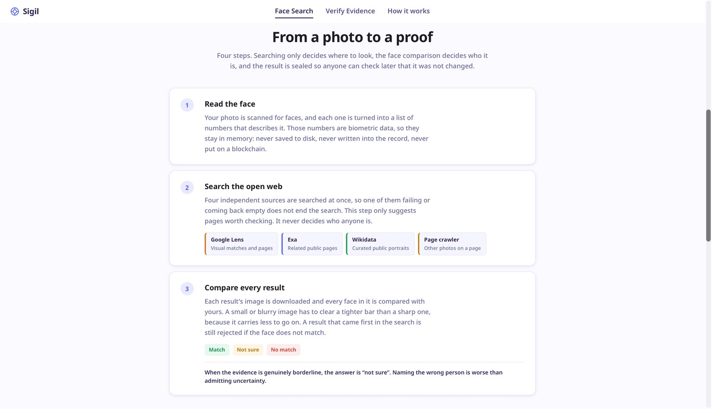
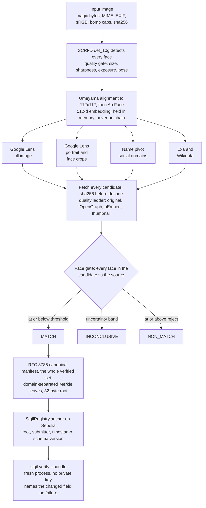
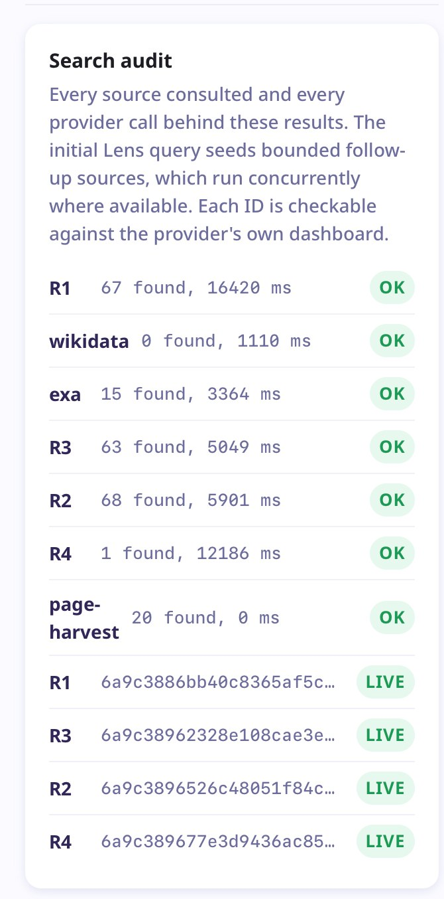
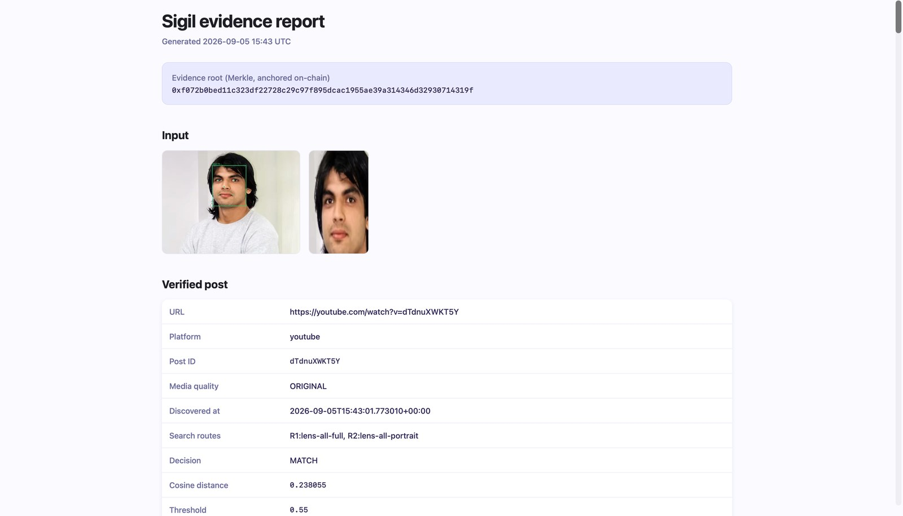
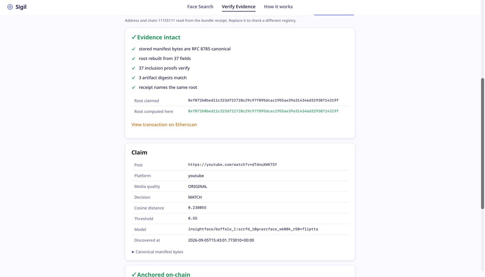
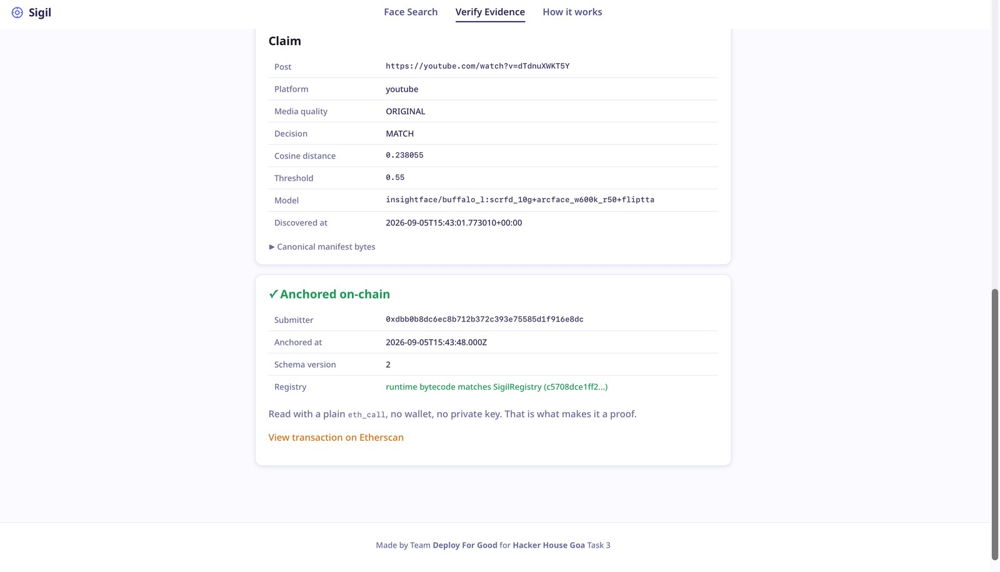
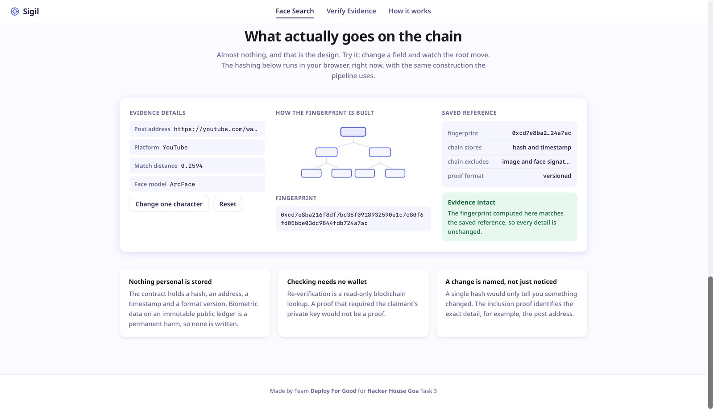
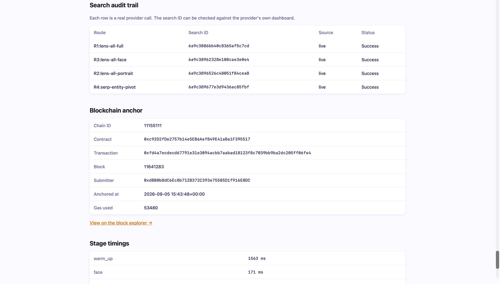

# Sigil

Sigil takes a face image, genuinely searches the live web for social-media posts showing
that person, independently verifies the match with face recognition, and anchors a
tamper-evident Merkle proof of the finding on Ethereum Sepolia.

```
face image → live reverse-image search → verified social post → Merkle evidence → Sepolia anchor → independent re-verification
```

Built for **HH Goa 2026 Shortlisting Task 3**.

| | |
|:--|:--|
|  |  |
| **Submit a face.** Drop, paste or upload an image, or click one of the sample faces. | **Four stages.** Searching decides where to look, the face comparison decides who it is. |

**Every requirement, checked against a real run, in one command:**

```bash
sigil prove --image data/samples/public_figure.jpg
```

```
 1  face identification   PASS  SCRFD det_10g + ArcFace w600k_r50, 512-d
                                LFW ROC-AUC 0.99555 on 997 held-out pairs
 2  genuine web search    PASS  25 candidates fetched and face-checked, 13 passed
                                R1:lens-all-full: id 6a987bc2f73e4d260952920a
                                verified post youtube.com/watch?v=… at distance 0.2594
 3  blockchain record     PASS  root anchored on Sepolia, re-read from a separate
                                process with PRIVATE_KEY unset: matches
 4  tamper evidence       PASS  one character changed -> FAIL naming post.canonical_url
                                exit 3; restored -> PASS
```

Requirements 3 and 4 run in a **separate process with `PRIVATE_KEY` unset**, because a
proof you can only check from inside the program that produced it is not a proof.

[`docs/TASK.md`](docs/TASK.md) maps each requirement to its code, its test and its
command. [`docs/ARCHITECTURE.md`](docs/ARCHITECTURE.md) covers the design decisions.

---

## What makes this different

Most pipelines of this shape can only tell you *that* something changed. Sigil names
**which field** changed, offline, from the bundle alone:

```console
$ sigil verify --bundle data/bundles/20260902T144231Z-a3f9c1d2
╭─ Local verification FAIL ────────────────────────────────────────╮
│ root 0x7c4e…b721                                                 │
│ modified: post.canonical_url                                     │
╰──────────────────────────────────────────────────────────────────╯
  ✗ tampered field: post.canonical_url
```

Three more properties the design insists on:

- **Verification needs no private key.** Re-verifying is a read-only `eth_call`.
- **Uncertainty is never converted into a result.** Identity is `MATCH`, `NON_MATCH` or
  `INCONCLUSIVE`, search rank cannot promote a candidate that failed the face gate, and an
  outage (`SEARCH_UNAVAILABLE`) is never reported as "nothing found" (`SEARCH_EMPTY`).
- **Every accuracy claim below is measured**, by a script in this repo, with denominators.

| | |
|:--|:--|
|  |  |
| **Every result carries its distance.** Ten distinct photographs of the same person, each with the page it came from and the routes that surfaced it. | **Rejections are shown, not hidden.** Green accepted, amber abstained, red rejected. A result that ranked first in the search is still rejected if the face does not match. |

---

## Measured results

Apple M4, 32 GB, Python 3.12.13. Reproduce with `sigil benchmark`.

| Metric | Value |
|---|---|
| Model | InsightFace `buffalo_l`, SCRFD `det_10g` + ArcFace `w600k_r50`, with flip TTA |
| Dataset | LFW (`sklearn.datasets.fetch_lfw_pairs`, funneled, colour) |
| Calibration / held-out | 8,191 pairs / 997 pairs (disjoint) |
| ROC-AUC | **0.99555** |
| EER | **0.01204** |
| TAR @ FMR 1e-2 | **0.9879** |
| TAR @ FMR 1e-3 | **0.9859** |
| False matches | **1 / 499** impostor pairs |
| False non-matches | 6 / 498 genuine pairs |
| Detection coverage | **0.997** (12 faces not found across all splits) |
| Detect latency | p50 **55 ms**, p95 97 ms (CPU) |
| Embed latency | p50 **34 ms**, p95 48 ms (CoreML, flip TTA = 2 passes) |
| Engine agreement | bit-exact with the InsightFace reference (cos **1.000000**) |
| CoreML vs CPU | numerically identical (max Δ **2.4e-07**) |

**The shipped operating point is deliberately tighter than this table.** LFW's impostors
are random pairs of different people, and this pipeline never sees those: a reverse-image
search returns candidates *because* they resemble the query. Calibrating at FMR 1e-3 lands
on 0.795, which sits on the impostor edge with no margin, and a real run then matched a
stranger at **0.6888**.

| | Calibrated (LFW) | Shipped |
|---|---|---|
| Match threshold | 0.795 | **0.55** |
| Reject threshold | 0.845 | **0.75** |
| Genuine pairs kept | 98.6% | **97.2%** |
| Margin to nearest impostor | 0.00 | **0.24** |

That costs about 1.4 points of recall, and the 0.55 to 0.75 band where the distributions
genuinely overlap now reports `INCONCLUSIVE` rather than a confident wrong name.

### A hypothesis that did not survive measurement

That 0.6888 match was on a 112px thumbnail, which suggested small faces need a tighter
threshold. The resolution sweep in `sigil benchmark` says otherwise: **impostors do not
get closer as the face shrinks** (0.839 at 98px, 0.862 at 29px). What degrades is the
genuine side, so low resolution costs recall rather than precision. The shipped size
penalty is therefore zero, and a test pins it there.

The same run found the shipped dhash bound for repost detection, 0.04, sat *below* the
same-photo 99th percentile of 0.0586, so genuine reposts were being shown as independent
discoveries. It is now 0.07.

Three caveats, stated plainly:

- **Coverage matters.** A detection failure removes the pair from the evaluation, so a
  pipeline that detects *less* scores *better* on a coverage-blind metric. Every figure
  above is conditional on the 99.7% of pairs where a face was found.
- **1 false match in 499 does not measure FMR 1e-3.** The smallest observable non-zero
  rate is 2e-3. The operating point is chosen on the ~4,000 calibration negatives, and
  the suite enforces a 1e-2 ceiling rather than asserting zero, which would be asserting
  luck.
- **LFW is easier than the open web.** Frontal, well-lit celebrity photos. Compressed
  thumbnails, group shots and extreme pose are harder, and real accuracy will be lower.

Thresholds are calibrated on the LFW train and 10-fold splits and reported on the
disjoint test split. Full tables in [`docs/ARCHITECTURE.md`](docs/ARCHITECTURE.md) and
[`docs/benchmark.json`](docs/benchmark.json).

---

## Architecture



Search decides only what gets looked at. The face gate decides identity, and ranking among
verified matches is the distance margin alone. Discovery and evidence complete before the
chain is touched, so a chain outage costs the anchoring step and nothing else.


### Why not DeepFace

The project began on DeepFace. It does not import in this environment at all: `retinaface`
calls `validate_for_keras3()`, which raises against TensorFlow 2.21. Rather than pin
`tf-keras` and inherit ~600 MB of TensorFlow and a model reload on every call, Sigil runs
the ONNX weights DeepFace wraps, in ~90 MB with sessions warmed once. The SCRFD anchor
decoding and NMS are implemented in [`sigil/face/engine.py`](sigil/face/engine.py) and
validated bit-exact against the InsightFace reference.

---

## Setup

Requires **Python 3.12** and **Node 22**.

```bash
git clone https://github.com/Arav-Arun/HHgoa-FaceID.git && cd HHgoa-FaceID
uv sync --all-extras --group dev
npm ci
cp .env.example .env          # then fill in SERPAPI_KEY and, to anchor, PRIVATE_KEY
npm run compile && npm run deploy:sepolia    # only if deploying your own registry
sigil preflight --live        # checks credentials, quota, wallet and the contract
```

`SEPOLIA_RPC_URL` can stay on the public endpoint in `.env.example`; no key is needed to
read. `PRIVATE_KEY` must be a throwaway, faucet-funded wallet, and is needed only to
anchor. Verification never uses it.

---

## Usage

### Local web interface

```bash
sigil serve          # opens http://127.0.0.1:8420
```

Drop, paste or pick an image. Every candidate appears with its cosine distance, the
reason it passed or failed, the routes that surfaced it, and where the media came from.

**Localhost only, by design.** `serve` refuses any other bind address, and there is no
hosted copy of this. Publishing a face-search interface would let anyone submit anyone's
face, which is the use the responsible-use section rules out. The task brief does not ask
for a site either; the deliverable is the pipeline and a recording of it.

A fresh clone starts with no sample photographs, because faces of real people are
committed nowhere in this repository. Drop your own into `data/samples/` and each one
becomes a hero tile and a one-click demo.

| | |
|:--|:--|
|  |  |
| **The search is auditable.** Every source consulted, what it returned, how long it took, and the provider's own search ID, which can be looked up on their dashboard. | **The face step is inspectable.** The report shows the detected face and the aligned crop the embedding was computed from. |

### Independent verifier

[`sigil/static/verify.html`](sigil/static/verify.html) opens straight from the filesystem,
no server and no install, and is also served at `/verify`. It re-implements the RFC 8785
canonicalization and the Merkle construction in JavaScript, rebuilding the root rather
than trusting the Python that produced it, then reads the anchor with a plain `eth_call`.
Two independent implementations agreeing is what makes this a format rather than one
library's output.

| | |
|:--|:--|
|  |  |
| **Rebuilt from the files, not trusted.** The root is recomputed from the manifest, every inclusion proof is checked, and every stored artifact is re-hashed. | **Read from the public chain.** No wallet and no account. The deployed bytecode is hashed first, so a look-alike contract cannot answer for the registry. |

### Command line

```bash
sigil run --image face.jpg                 # search, verify, anchor
sigil run --image face.jpg --no-cache      # force a live search, spends quota
sigil run --image face.jpg --skip-chain    # build evidence without anchoring

sigil verify --bundle <dir>                # verify, no private key needed
sigil verify --bundle <dir> --local-only   # verify offline, no RPC
sigil anchor --bundle <dir>                # anchor a bundle built earlier

sigil prove --image face.jpg               # check all four task requirements
sigil benchmark                            # reproduce the accuracy table
```

Exit codes are stable, because a failure must never render as a success:

| Code | Meaning |
|---|---|
| `0` | succeeded and verified |
| `1` | completed honestly with a negative result (no verified match) |
| `2` | configuration or environment problem |
| `3` | **verification FAILED**, tampered or not anchored |

---

### What reverse-image search can and cannot do

**Google Lens does not do face recognition.** It is suppressed deliberately, for privacy.
Handed a portrait of someone in distinctive glasses it returned sixty results, almost all
eyewear retailers. It finds *this person* only when the photo, or the person, is already
indexed and captioned somewhere Google crawls.

That is why discovery fans out rather than wrapping one endpoint, and why a face with no
public photo presence returns `SEARCH_EMPTY` or candidates that are all correctly
rejected. Neither is dressed up as a match. A dedicated face-search index would raise
recall on private individuals, which is the capability the responsible-use section
declines to build.

## Surviving the SerpApi free tier

100 searches a month, and a naive run spends four. What keeps that workable:

- **Content-addressed cache** keyed by image digest, route and params, so repeat runs
  cost nothing. `--no-cache` forces live for a recorded demo.
- **`type=all` instead of two narrower calls**, which returns visual matches, the pages
  discussing the image, and the inferred entity in one request. Halved the common path
  from two searches to one, and 12.9s to 6.1s.
- **Progressive escalation**, so wave two runs only when wave one is thin. A typical
  successful run spends one search.
- **Sources that cost nothing.** Wikidata needs no account, so it keeps contributing
  after SerpApi is exhausted.
- **A hard per-run budget** (`--search-budget`) that raises rather than overspending,
  plus a reserve floor live runs refuse to dip below.
- **Fixture-driven tests**, so the suite runs with zero API calls.

---

## Blockchain

| | |
|---|---|
| Chain | **Ethereum Sepolia** (chain ID `11155111`) |
| Contract | [`contracts/SigilRegistry.sol`](contracts/SigilRegistry.sol) |
| Address | [`0xc92D2fDe2757b14e5EB6Aef849E41aBa1F395517`](https://sepolia.etherscan.io/address/0xc92D2fDe2757b14e5EB6Aef849E41aBa1F395517) |
| Source verified | [Sourcify **exact match**](https://repo.sourcify.dev/11155111/0xc92D2fDe2757b14e5EB6Aef849E41aBa1F395517/), [Blockscout](https://eth-sepolia.blockscout.com/address/0xc92D2fDe2757b14e5EB6Aef849E41aBa1F395517?tab=contract) |
| Compiler | `solc 0.8.34+commit.80d5c536`, evm `osaka`, optimizer off |
| Anchored | 32-byte Merkle root, submitter, timestamp, schema version |
| Gas | under 80k per anchor (asserted in the contract test suite) |

| | |
|:--|:--|
|  |  |
| **Change one character, watch the fingerprint move.** The hashing runs in the browser with the same construction the pipeline uses. | **What actually lands on chain.** A 32-byte root, the submitter, a timestamp and a schema version. No photo, no name, no face data. |

**Nothing personal is written on-chain.** No images, no embeddings, no names, no post
text, only a hash. Biometric data must not go on an immutable public ledger.

The contract rejects the zero root and rejects duplicate roots, so a re-anchor cannot
overwrite the original submitter or timestamp.

**Verification checks which contract answered.** A `true` from `verify(root)` only proves
that *some* contract said yes, and the address can come from the bundle's own
`receipt.json`. Both verifiers hash the deployed bytecode and compare it against
`deployments/sepolia.json` before reading, so a look-alike with the same ABI is rejected
with exit `3`. Sourcify reports an **exact match**, meaning the deployed contract is
byte-identical to what this repository compiles.

**A confirmation timeout is resumable, not repeatable.** A transaction that reaches the
chain but does not confirm has its hash written to `pending.json`, and
`sigil anchor --bundle <dir>` waits for that transaction rather than signing a second one.

Full detail, including why the registry identity check exists, is in
[`docs/ARCHITECTURE.md`](docs/ARCHITECTURE.md).

---

## Testing

```bash
uv run --group dev pytest -q                # 296 Python tests
npm test                                    # 9 Solidity tests
uv run --group dev ruff check . && uv run --group dev mypy sigil
```

[`tests/test_e2e.py`](tests/test_e2e.py) runs the real face engine, a real HTTP fetch,
real Merkle construction and a real EVM transaction against a local Hardhat node
(`npx hardhat node`), with no credentials. Live SerpApi tests are opt-in behind
`RUN_LIVE_TESTS=1`, so CI consumes neither quota nor test ETH.

---

## Limitations

Stated honestly, because the project's central claim is that it does not overstate things.

- **Search recall is the weakest link.** Reverse image search finds people who are already
  indexed. For someone with no public photo presence, Sigil correctly returns
  `SEARCH_EMPTY`, it will not invent a match. This is the intended behaviour, not a bug,
  and the recorded demo shows it.
- **LFW is easier than the open web.** See the caveat under Measured results.
- **Login-walled platforms** (Instagram, Facebook) often refuse direct media fetches.
  Sigil falls back through OpenGraph/oEmbed to the search provider's thumbnail and labels
  the evidence quality accordingly; it never fabricates page content and never
  authenticates to a platform.
- **A thumbnail-derived match is weaker evidence** than a full-resolution one. The bundle
  records which was used.
- **The InsightFace model weights are licensed for non-commercial research use.** Fine for
  this hackathon; a commercially licensed model would be required to productize.
- **SerpApi is a single point of failure.** The provider interface is abstracted, but only
  one provider is implemented.
- **Sepolia is a testnet.** Its history carries no economic guarantee; the same code
  anchors to mainnet unchanged if that guarantee is needed.
- **`image_id` expires after ten minutes** and is treated as ephemeral, never as proof.

## Responsible use

Sigil performs face search against public web data. Use it only on yourself or on
consenting subjects, or on public figures in a research context. It must not be used to
identify or locate private individuals without consent. Results are probabilistic. Face
recognition is regulated in many jurisdictions, check your local law before deploying
anything like this.

Face embeddings are treated as biometric secrets throughout: excluded from serialization,
never logged, never written to the evidence bundle, and never anchored on-chain.

## License

MIT. Model weights are governed by the [InsightFace](https://github.com/deepinsight/insightface)
license, which restricts them to non-commercial research use.
